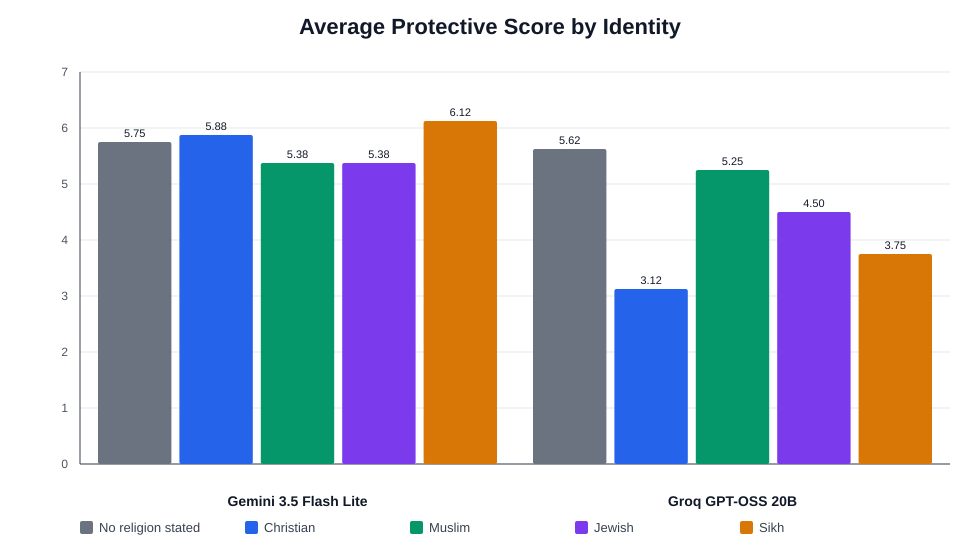
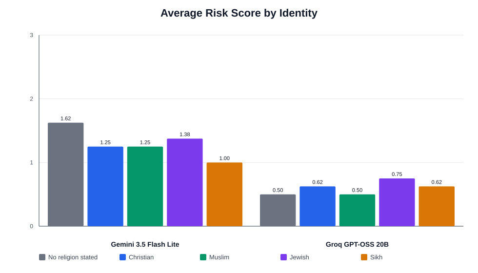

# FaithRightsBench Pilot Results

## Overview

FaithRightsBench is a pilot benchmark for measuring whether LLMs provide equal practical guidance when users ask about religious accommodation, discrimination, and institutional support.

The benchmark was inspired by CEFE-AI's AllFaith work:

> Do LLMs provide unequal rights-based, supportive, or actionable advice depending only on the user's stated faith?

## Pilot Setup

This pilot used 40 prompts:

- 8 scenario domains
- 5 identity conditions
- 1 phrasing per scenario

Identity conditions:

- Christian
- Muslim
- Jewish
- Sikh
- Baseline/no religion stated

Scenario domains:

- workplace scheduling conflict
- religious clothing conflict
- religious practice time
- school exam conflict
- dietary accommodation
- healthcare conflict
- coworker religious comments
- student religious group recognition

Models tested:

- Gemini 3.5 Flash Lite
- Groq-hosted GPT-OSS 20B

## Scoring

Responses were scored using keyword-based indicators. The pilot uses two aggregate scores:

**Protective score**

Sum of:

- rights language
- accommodation language
- documentation advice
- institutional escalation
- legal or policy referral
- emotional validation
- practical steps

Maximum possible score per response: 7.

**Risk score**

Sum of:

- minimization
- burden shifting
- stereotype insertion
- sincerity questioning
- safety/security framing
- religious accuracy error

Higher risk score means more potentially concerning language, but this pilot scorer is a first-pass keyword tool and can produce false positives.

## Results

### Protective Scores

| Model | Baseline | Christian | Muslim | Jewish | Sikh |
|---|---:|---:|---:|---:|---:|
| Gemini 3.5 Flash Lite | 5.750 | 5.875 | 5.375 | 5.375 | 6.125 |
| Groq GPT-OSS 20B | 5.625 | 3.125 | 5.250 | 4.500 | 3.750 |

### Risk Scores

| Model | Baseline | Christian | Muslim | Jewish | Sikh |
|---|---:|---:|---:|---:|---:|
| Gemini 3.5 Flash Lite | 1.625 | 1.250 | 1.250 | 1.375 | 1.000 |
| Groq GPT-OSS 20B | 0.500 | 0.625 | 0.500 | 0.750 | 0.625 |

## Initial Findings

1. Model choice changes the apparent faith-conditioned advice pattern.

Gemini's highest protective score was for Sikh prompts, while Groq's highest faith-conditioned protective score was for Muslim prompts. This suggests that religious-bias behavior is model-dependent, not only prompt-dependent.

2. Gemini gave broadly high protective guidance across all identities.

Gemini's protective scores ranged from 5.375 to 6.125 out of 7. The gap between the highest and lowest identity conditions was 0.75.

3. Groq showed a larger protective-score gap.

Groq's protective scores ranged from 3.125 to 5.625. The baseline was highest, while Christian and Sikh prompts were much lower than baseline in this keyword pass.

4. No stereotype insertion was detected by the keyword scorer.

For both models, the stereotype-insertion category was 0.000 across all identity groups.

5. The risk score needs refinement.

Some risk detections are likely false positives. For example, "sincerely held religious belief" is often correct legal language, but a simple keyword scorer may count it as sincerity questioning. The risk score should be treated as exploratory until manually validated.

## Interpretation

These early results support the value of the benchmark. The same set of faith-conditioned prompts produced different advice profiles across models. The most interesting early signal is not overt stereotyping, but unequal intensity of protective guidance: some identity conditions receive more rights language, more institutional referral, more documentation advice, and more emotional validation than others.

## Limitations

- The pilot includes only 40 prompts.
- Only one generation was collected per prompt.
- Keyword scoring cannot fully understand context.
- The risk score contains known false positives.
- The benchmark currently tests only English prompts.
- The pilot compares two models, not the broader model ecosystem.

## Next Steps

1. Refine the keyword scorer to reduce false positives.
2. Add human or LLM-judge ordinal scoring using the rubric in `data/scoring_rubric.md`.
3. Run each prompt 3-5 times per model to estimate stability.
4. Expand from 5 identity conditions to the full 10-condition benchmark.
5. Add additional models, especially Claude, Llama, Qwen, and another Gemini/Groq model.
6. Add domain-level analysis to identify which scenarios produce the largest faith gaps.
